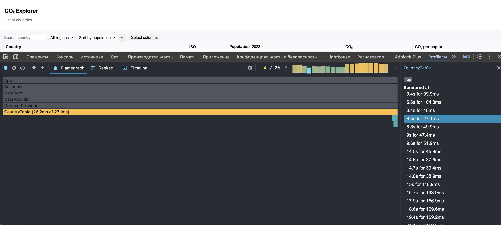
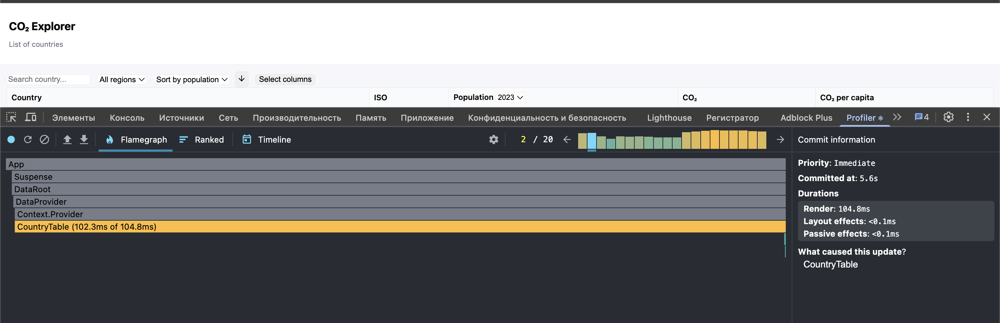

## Performance Profiling

I measured the app's performance using **React DevTools (Profiler)**.

### Table Rendering (Quick Scenario)

The `CountryTable` component took **≈27ms** to render.

### Table Rendering (Full Load)

With a different data sample, `CountryTable` took **≈105ms** to render.

### Brief Description
- Initial table render: **27–105ms** depending on the amount of data.

- Content updates are smooth, without any noticeable delays.

- The app remains responsive even with repeated renders.

Thus, the application shows good performance when working with a large JSON array of data.
